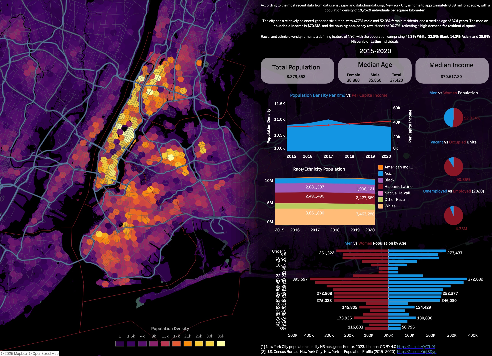

# NYC Census Study

I pulled five years of NYC demographic data from the U.S. Census Bureau and asked a straightforward question: where do people actually live in this city, who are they, and what shifted across a recent five year window?

The results feed a Tableau dashboard and a small Python extraction pipeline. This repository contains the exported CSVs used in the study and the script that generated them.

## Dashboard

Tableau placeholder: [View on Tableau Public](https://public.tableau.com/app/profile/rick1462/viz/NYCCensusPopulation/Main)



The dashboard contains:

- A hexagonal population density map of New York City.
- A demographics overview covering population, age, income, race and ethnicity, housing, and labor indicators.
- A population pyramid and KPI summary charts.

## Colab

[Open `census.py` in Google Colab](https://colab.research.google.com/drive/1ig4XrZB2vG2OeopnolBLRZegTyif4pjL#scrollTo=m9RVGtT4YEwa)
 
---

## Repository Layout

```text
nyc-census-study/
├── census.py
├── assests/
│   └── Dashboard_Screenshot.jpeg
├── data/
│   ├── nyc_additional_demographics_2020.csv
│   ├── nyc_demographics_2015_2020.csv
│   └── nyc_population_pyramid_2020.csv
├── .gitignore
├── LICENSE
└── README.md
``` 
---

## Data Pipeline

The script uses the [`censusdis`](https://github.com/censusdis/censusdis) library to query the U.S. Census Bureau American Community Survey and aggregates the five NYC boroughs into a city level dataset.

NYC county FIPS codes:

| Borough | County | FIPS |
| --- | --- | --- |
| Bronx | Bronx County | 005 |
| Brooklyn | Kings County | 047 |
| Manhattan | New York County | 061 |
| Queens | Queens County | 081 |
| Staten Island | Richmond County | 085 |

The script exports 3 csv files:

| File | Description |
| --- | --- |
| `data/nyc_population_pyramid_2020.csv` | Population by age group and sex for the most recent year in the export |
| `data/nyc_demographics_2015_2020.csv` | Six annual ACS exports covering population, race, income, housing, and density |
| `data/nyc_additional_demographics_2020.csv` | Education, labor force, unemployment, and poverty indicators |
 
---

## Run Locally

Install dependencies:

```bash
pip install censusdis numpy pandas
```

### Get a Census API Key
 
Register for a free key at [api.census.gov/data/key_signup.html](https://api.census.gov/data/key_signup.html)

Set your Census API key:

```bash
export CENSUS_API_KEY=your_key_here
```

Then run:

```bash
python census.py
```

The script writes CSV outputs to the local `data/` directory.


## Notes

- ACS 5 year estimates are rolling averages, not single year point in time snapshots.
- Median age and income values are approximated from borough level values rather than reconstructed from microdata.
- The current checked in exports span `2015-2020`, which is the output presently included in this repository.

## Sources

- U.S. Census Bureau ACS 5 Year Estimates via [`data.census.gov`](https://dub.sh/YqtSDyp)
- `censusdis` for Census API access
- Kontur population density tiles for the map layer referenced in the dashboard via [`data.humdata.org`](https://dub.sh/QYZtt9f)
